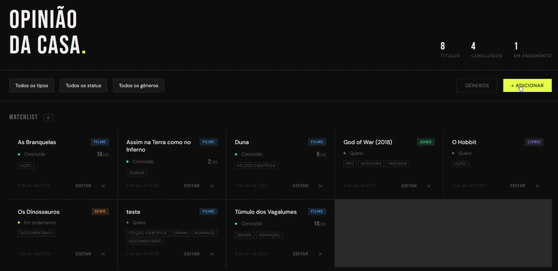

# Opinião da Casa

Uma watchlist colaborativa para organizar filmes, livros, jogos e séries. O projeto foi desenhado para ser acessível por qualquer dispositivo na rede local (celular, tablet, PC) através de uma infraestrutura containerizada.



## Stack

| Camada             | Tecnologia                          |
| ------------------ | ----------------------------------- |
| **Backend**        | Python + FastAPI                    |
| **Banco de Dados** | PostgreSQL 16                       |
| **ORM**            | SQLAlchemy                          |
| **Validação**      | Pydantic v2                         |
| **Frontend**       | HTML5 + CSS3 + JavaScript (Vanilla) |
| **Servidor Web**   | Nginx (Proxy Reverso)               |
| **Infraestrutura** | Docker + Docker Compose             |

## Destaques Técnicos

- **Agnóstico de Ambiente:** Graças ao uso de `window.location.origin` no frontend e Proxy Reverso no Nginx, a aplicação funciona em qualquer IP ou domínio sem necessidade de alterar o código-fonte.
- **Resiliência com Docker DNS:** Configuração de `resolver 127.0.0.11` no Nginx para garantir que o serviço inicie corretamente mesmo com dependências em boot.
- **Segurança:** Gestão de credenciais sensíveis via variáveis de ambiente (`.env`).
- **Arquitetura REST:** API totalmente documentada com Swagger, seguindo os padrões de métodos HTTP e códigos de status semânticos.

## Como Rodar

### 1. Pré-requisitos

- [Docker Desktop](https://www.docker.com/products/docker-desktop/) instalado e rodando.

### 2. Configuração inicial

Crie o arquivo de variáveis de ambiente na raiz do projeto:

```bash
cp .env.example .env
```

_(As senhas padrão já estão configuradas para rodar localmente, mas podem ser alteradas no arquivo `.env`)_

### 3. Subir o ambiente

```bash
docker compose up --build -d
```

### 4. Acessar a aplicação

| Serviço              | Endereço                                                 |
| -------------------- | -------------------------------------------------------- |
| **Frontend**         | [http://localhost](http://localhost)                     |
| **Documentação API** | [http://localhost:8000/docs](http://localhost:8000/docs) |

## Acesso pela Rede Local

Para acessar de um celular ou outro computador na mesma rede Wi-Fi:

1. Descubra o IP da sua máquina (Windows: `ipconfig` | Linux/Mac: `ifconfig` [Em algumas distribuições Linux modernas, o comando ifconfig pode não estar instalado por padrão; utilize ip addr como alternativa]).
2. No navegador do dispositivo móvel, digite: `http://SEU_IP_AQUI` (ex: `http://192.168.15.10`).

---

## Estrutura do Projeto

```
opiniao/
├── backend/       # API FastAPI e lógica de negócio
├── frontend/      # Interface Web e configuração Nginx
├── .env.example   # Modelo de variáveis de ambiente
└── docker-compose.yml
```

## Modelo de Dados

- **Relacionamento Many-to-Many:** Itens podem ter múltiplos gêneros e gêneros pertencem a múltiplos itens.
- **Persistência:** Dados armazenados em volumes Docker (`pgdata`), garantindo que não sejam perdidos ao reiniciar os containers.
